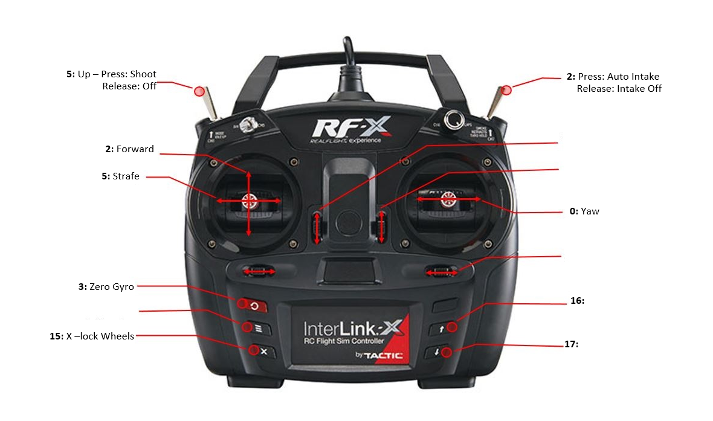

# 2020 FIRST INFINITE RECHARGE

## Controls

## Talons

| Subsystem | Type | Talon      | ID  | PDP |
| --------- | ---- | ---------- | --- | --- |
| Drive     | SRX  | azimuth    | 0   | 6   |
| Drive     | SRX  | azimuth    | 1   | 4   |
| Drive     | SRX  | azimuth    | 2   | 7   |
| Drive     | SRX  | azimuth    | 3   | 5   |
| Drive     | FX   | drive      | 10  | 2   |
| Drive     | FX   | drive      | 11  | 0   |
| Drive     | FX   | drive      | 12  | 3   |
| Drive     | FX   | drive      | 13  | 1   |
| Intake    | FX   | intake     | 20  | 15  |
| Magazine  | SRX  | magazine   | 30  | 9   |
| Shooter   | FX   | leftMaster | 40  | 12  |
| Shooter   | FX   | rightSlave | 41  | 13  |
| Shooter   | SRX  | turret     | 42  | 10  |
| Shooter   | SRX  | hood       | 43  | 11  |
| Climb     | SRX  | climb      | 50  | 14  |

- Intake beam break routed to reverse limit switch on magazine
- Magazine beam break routed to forward limit switch on hood

## Servos

| Subsystem | Servo   | ID  |
| --------- | ------- | --- |
| Climb     | ratchet | 0   |

## DIO

| Subsystem       | DIO      | ID  |
| --------------- | -------- | --- |
| AutonSwitch     | 0        | 0   |
| AutonSwitch     | 1        | 1   |
| AutonSwitch     | 2        | 2   |
| AutonSwitch     | 3        | 3   |
| AutonSwitch     | 4        | 4   |
| DIO Pin Missing | 5        | 5   |
| AutonSwitch     | 6        | 6   |
| EventFlag       | flag     | 8   |
| Constants       | protoBot | 9   |

## Auto Switch

| Switch | Auton          |
| ------ | -------------- |
| 0x10   | no delay shoot |
| 0x11   | 4 sec delay    |
| 0x12   | 8 sec delay    |
| 0x13   | 10 sec delay   |
| 0x20   | trench auto    |
| 0x30   | 90 degree feed |
